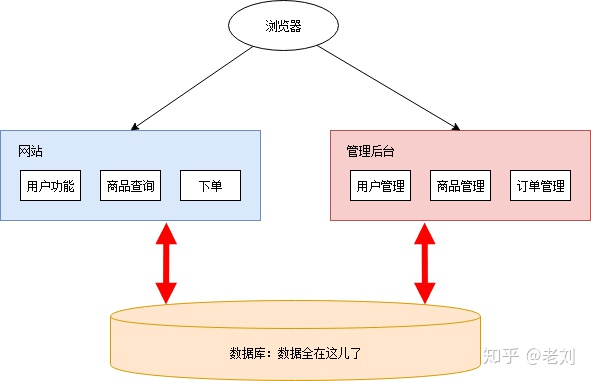
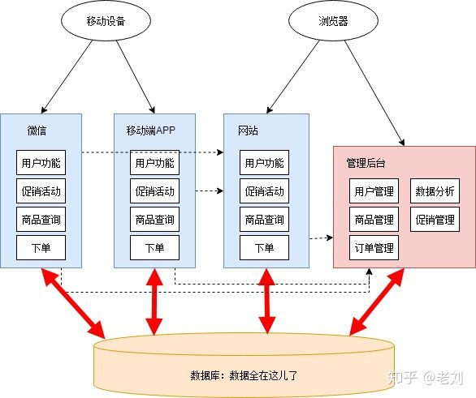
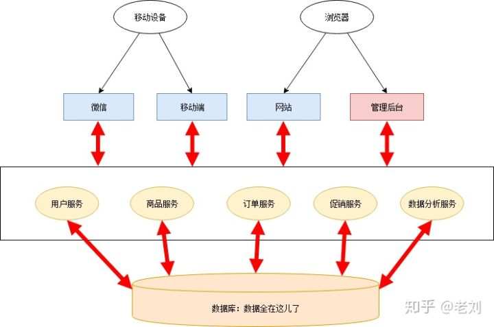
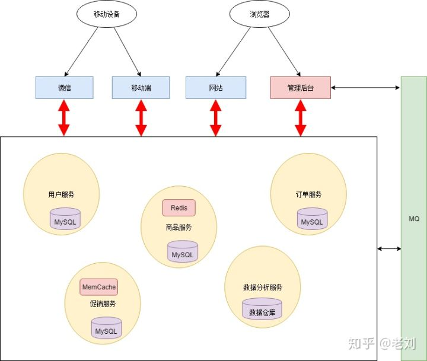
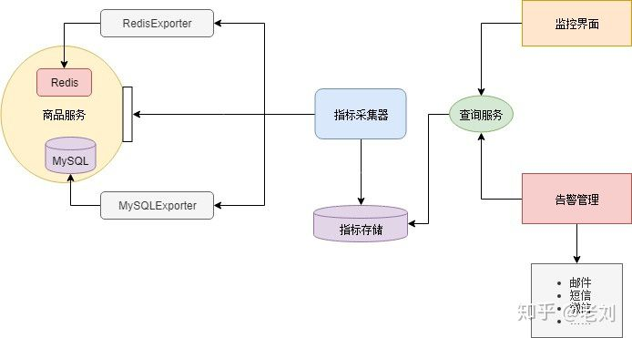

# 微服务

> “微服务架构是一种架构模式，它提倡将单一应用程序划分成一组小的服务，服务之间相互协调、互相配合，为用户提供最终价值。每个服务运行在其独立的进程中，服务和服务之间采用轻量级的通信机制相互沟通（通常是基于HTTP的Restful API).每个服务都围绕着具体的业务进行构建，并且能够被独立的部署到生产环境、类生产环境等。另外，应尽量避免统一的、集中的服务管理机制，对具体的一个服务而言，应根据业务上下文，选择合适的语言、工具对其进行构"---- Martin Fowler的博客

## 背景历史

  

    
    &nbsp;&nbsp;=》&nbsp;&nbsp;
     
    &nbsp;&nbsp;=》&nbsp;&nbsp;
     
    &nbsp;&nbsp;=》&nbsp;&nbsp;
     
    &nbsp;&nbsp;=》&nbsp;&nbsp;
     
  

## 开源框架

- [Tars.js](https://github.com/tars-node/Tars.js)

## 常见问题

### 服务通信

- [Best practices to communicate between microservices](https://irfanyusanif.medium.com/how-to-communicate-between-microservices-7956ed68a99a)

## 参考书籍

- [《微服务治理：体系、架构及实践》](https://book.douban.com/subject/35092430/)
- [《生产微服务》](https://book.douban.com/subject/27127050/)

## 参考文献

- [什么是微服务架构？](https://www.zhihu.com/question/65502802/answer/802678798)
- [Java 微服务框架选型（Dubbo 和 Spring Cloud？）](https://www.cnblogs.com/xishuai/p/dubbo-and-spring-cloud.html)